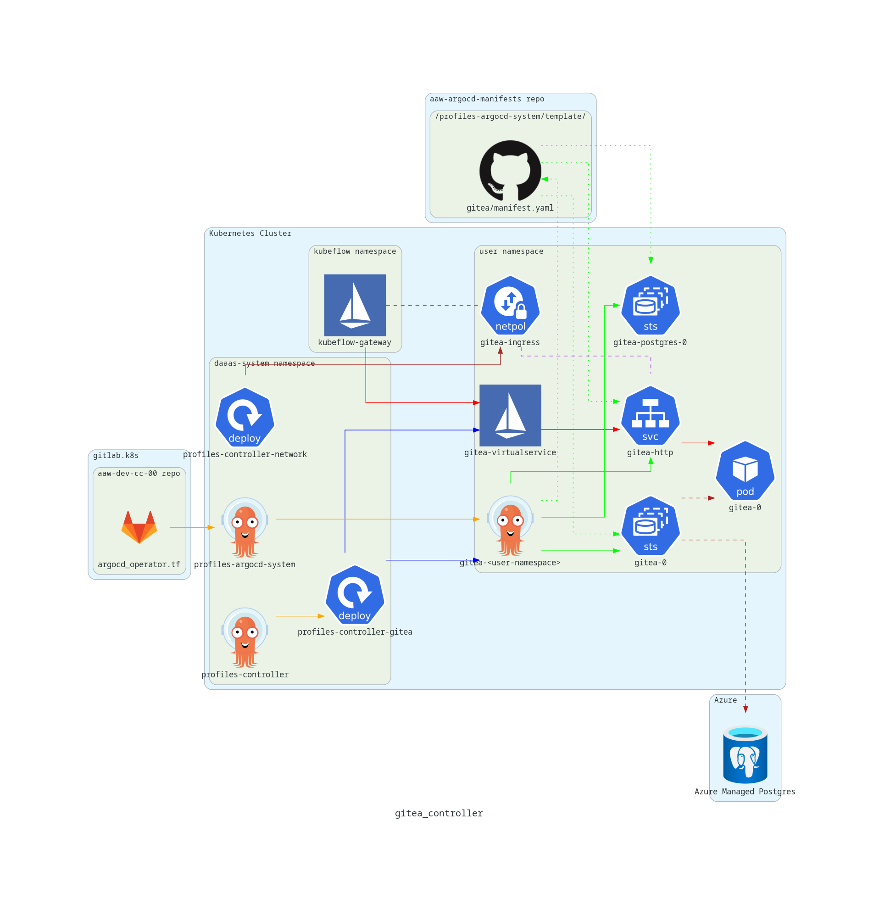

# profiles-controller

This repository implements custom controllers for watching `Profile` resources from Kubeflow.

## Overview

The diagram below illustrates how profiles controller components are rolled out on the cluster.[^1][^2][^3][^4]

[^1]: Gitlab icons provided by [Gitlab Press Kit](https://about.gitlab.com/press/press-kit/).
[^2]: Github icons provided by [Github logos](https://github.com/logos).
[^3]: Argo icon provided by [CNCF branding](https://cncf-branding.netlify.app/projects/argo/).
[^4]: Moby (Docker) icon provided by [icons8](https://icons8.com/icons/set/docker)

### How to Create a Controller

**Note**: Modifying a controller is a subset of these steps; if you are only updating an existing controller, ignore the steps that don't apply.

1. Create a `.go` file in the `cmd` folder of **this** repository with the name of your controller. Your controller must create a `cobra.Command` and register it with the `rootCmd` of the application. Your controller will be invoked with the entrypoint `./profiles-controller <your controller name>`.
2. Modify the profiles-controller helm chart in the [StatCan charts](https://github.com/StatCan/charts) repo. Add the deployment containing your new controller and update the `values.yaml` file accordingly with any new parameters specific to your container.
3. Once your new controller is ready, merge your branch to the `main` branch of **this** repository. A Github action in **this** repository runs a build job (see `.github/workflows/build.yml`) that builds the profiles-controller container image and pushes it to Azure container registry. The pushed image is tagged with the commit SHA of the git commit that triggered the Github Action.
4. Go to the build job in the Github action and copy the commit SHA that the image is tagged with to your clipboard. This can be found at the top of the step called **Run docker build** in the **build** job.
5. Go to the [aaw-argocd-manifests](https://github.com/StatCan/aaw-argocd-manifests) repository and open the `application.jsonnet` file that deploys the `profiles-controller` ArgoCD application in the `daaas-system` namespace. In this file, paste the commit SHA from the previous step to the `image.tag` field. This updates the image tag for the base image used by the `profiles-controller` deployment. Note that you can make this edit directly through Github's editing features. This edit should be merged into either the `aaw-dev-cc-00` branch or the `aaw-prod-cc-00` branch depending on whether the update applies to the dev or prod environments. The `profiles-controller` ArgoCD application watches for changes to the `application.jsonnet` file on these branches.

### Controllers that Deploy Per-Namespace Applications

Some controllers deploy per-namespace applications for each user (e.g. Gitea, S3Proxy). In this case, a few additional steps may be required.

1. The `profiles-argocd-system` folder of the [aaw-argocd-manifests](https://github.com/StatCan/aaw-argocd-manifests) repository contains manifests that get deployed by per-namespace ArgoCD applications. The intended pattern is that Kubernetes manifests are applied directly with Kustomize patches as required.
2. Depending on what a particular per-namespace application looks like, there may be a manual step required where a developer must build the manifests by, for example, templating a helm chart and saving the output in a `manifest.yaml` file. In this case, a PR must be made to either the `aaw-dev-cc-00` or `aaw-prod-cc-00` branches of the aaw-argocd-manifests repo with the newly build `manifest.yaml` file.

## Terminology

Helpful links to k8s resources, technologies and other terminologies related to this project are provided below.

- [Profile](https://www.kubeflow.org/docs/components/multi-tenancy/getting-started/)
- [Istio AuthorizationPolicy](https://istio.io/latest/docs/reference/config/security/authorization-policy/#Source)
- [LimitRange](https://kubernetes.io/docs/concepts/policy/limit-range/)
- [ResourceQuotas](https://kubernetes.io/docs/concepts/policy/resource-quotas/)
- [Kubeflow Notebook](https://www.kubeflow.org/docs/components/notebooks/overview/)
- [Roles and RoleBinding (RBAC)](https://kubernetes.io/docs/reference/access-authn-authz/rbac/)
- [Labels](https://kubernetes.io/docs/concepts/overview/working-with-objects/labels/)
- [Blob CSI Driver](https://github.com/kubernetes-sigs/blob-csi-driver)
- [Open Policy Agent (OPA)](https://www.openpolicyagent.org/)

## Details

The profiles controller uses [client-go library](https://github.com/kubernetes/client-go/tree/master/tools/cache) extensively.
The details of interaction points of the profiles controller with various mechanisms from this library are
explained [here](docs/controller-client-go.md).

## Controllers

The [cmd](./cmd) package contains source files for a variety of profile controllers for Kubeflow.

For more information about profile controllers, see the documentation for the [client-go](https://github.com/kubernetes/client-go/) library, which contains a variety of mechanisms for use when
developing custom profile controllers. The mechanisms are defined in the
[tools/cache folder](https://github.com/kubernetes/client-go/tree/master/tools/cache) of the library.

### [authpolicy.go](./cmd/authpolicy.go)

Responsible for creating, removing and updating [Istio Authorization Policies](https://istio.io/latest/docs/reference/config/security/authorization-policy/#Source) using the [Istio client](https://github.com/istio/client-go) for a given `Profile`. Currently, the only `AuthorizationPolicy` is to block upload/download from protected-b `Notebook`'s.

### [blob-csi.go](./cmd/blob-csi.go)

Creates an Azure Blob Storage container for a user in a few storage accounts (e.g. `standard`, `protected-b`, etc.) and binds a PersistentVolume to the container using the [blob-csi driver](https://github.com/kubernetes-sigs/blob-csi-driver). This relies on secrets stored in a system namespace --- secrets are not accessible by users. The controller also creates a PVC in the users namespace bound to this specific PV.

- Supports read-write and read-only PersistentVolumes using mountOptions.
- PVCs are ReadWriteMany or ReadOnlyMany, respectively
- Supports both protected-b and unclassified mounts.

In addition, the controller is responsible for managing links from `PersistentVolume`'s to any buckets from Fair Data Infrasure (FDI) Section of DAaas.  This is accomplished by querying unclassified and protected-b `OPA` gateways which return `json` responses containing buckets along with permissions.

*This will deprecate the minio controller.*

#### Local Development
The [Taskfile](./Taskfile.yml) includes task `blobcsi:dev` for preparing your local environment for development and testing. Due to the controller's dependency on Azure [blob-csi driver](https://github.com/kubernetes-sigs/blob-csi-driver) a cluster with the [blob-csi driver](https://github.com/kubernetes-sigs/blob-csi-driver) installed is required. As such, it is recommended to debug and test against the development k8s context for AAW. With the local environment configured, the Vscode Debugger can be used through `Run and Debug: blobcsi Controller` in the debug pane.

### [gitea.go](./cmd/gitea.go)

Responsible for deploying [gitea](https://github.com/go-gitea/gitea) as [argocd](https://github.com/argoproj/argo-cd) applications per `Profile`. Currently, [argocd](https://github.com/argoproj/argo-cd) applications are deployed by the gitea controller based on the customized gitea manifest found [here](https://github.com/StatCan/aaw-argocd-manifests/tree/aaw-dev-cc-00/profiles-argocd-system/template/gitea).

The diagram below highlights the key components involved with the Gitea controller[^5]

#### Gitea User Interface

The Gitea user interface is embedded within the [Kubeflow dashboard](https://github.com/StatCan/aaw-kubeflow-manifests/blob/aaw-dev-cc-00/kustomize/apps/centraldashboard/base/centraldashboard-config.yaml)'s user interface, rendered by an iframe.

Requests to a namespace's Gitea server are made to the Kubeflow base url with the suffix `/gitea/?ns=<user-namespace>`, where the user's namespace is passed as an http parameter. An Istio Virtual Service created by the `gitea.go` controller contains an http route that redirects traffic from `/gitea/?ns=<user-namespace>` to `/gitea/<user-namespace>/`. A second http route routes traffic from `/gitea/<user-namespace>/` to the Gitea instance in the user's namespace.

The [Gitea application server](https://github.com/StatCan/aaw-argocd-manifests/blob/aaw-dev-cc-00/profiles-argocd-system/template/gitea/) sets the `ROOT_URL` environment variable to contain the Kubeflow base URL with the `/gitea/<user-namespace>/`. This is required as it is the application's responsibility to establish the URLS that will be used in the browser to retrieve static assets and send requests to application endpoints.

The Gitea application [values.yaml file](https://github.com/StatCan/aaw-argocd-manifests/blob/aaw-dev-cc-00/profiles-argocd-system/template/gitea/values.yaml#L37-L45) makes use of [pod fields as environment variables](https://kubernetes.io/docs/tasks/inject-data-application/environment-variable-expose-pod-information/) and [dependent environment variables](https://kubernetes.io/docs/tasks/inject-data-application/define-interdependent-environment-variables/#define-an-environment-dependent-variable-for-a-container) to create a `ROOT_URL` that depends on the user's namespace. Additionally, an [upstream gitea issue](https://github.com/go-gitea/gitea/issues/6397) indicates that it is possible to set multiple domains in the `ROOT_URL` environment variable by using the syntax `ROOT_URL=https://(domain1,domain2)/gitea/`, which is how the dev/prod domains are set without needing to check the deployment environment.

To allow requests to reach the user's Gitea instance, a Network Policy is set in the user's namespace that allows ingress traffic from the kubeflow-gateway to be sent to any pods in the user's namespace that match the `app: gitea` label selector.

[^5]: Istio icons provided by [Istio Media Resources](https://istio.io/latest/about/media-resources/)

### [limitrange.go](./cmd/limitrange.go)

Responsible for creating, removing and updating `LimitRange` resources for a given profile. `LimitRange` resources are generated to limit the cpu and memory resources for the kubeflow profile's default container. `LimitRange` resources require the implementation of a controller managing `ResourceQuotas`, which is provided in this package (see [quotas.go](./cmd/quotas.go)). Implementing `LimitRange` resources allows any Pod to run associated with the `Profile`, restricted by a `ResourceQuota`.

### [minio.go](./cmd/minio.go)

Responsible for the configuration of MinIO buckets for the given `Profile`. Configured MinIO buckets may be used by the associated `Profile` for object storage accessible directly within their notebooks.

### [network.go](./cmd/network.go)

Responsible for the following networking policies:

- Ingress from the ingress gateway
- Ingress from knative-serving
- Egress to the cluster local gateway
- Egress from unclassified workloads
- Egress from unclassified workloads to the ingress gateway
- Egress to port 443 from protected-b workloads
- Egress to the daaas-system
- Egress to vault
- Egress to pipelines
- Egress to MinIO
- Egress to Elasticsearch
- Egress to Artifactory

### [notebook.go](./cmd/notebook.go)

Responsible for the configuration of `Notebook` resources within Kubeflow. This controller adds a default option for running a protected-b `Notebook`.

### [quotas.go](./cmd/quotas.go)

Responsible for the generation of `ResourceQuotas` for a given profile. Management of `ResourceQuotas` is essential, as it provides the constraint for total amount of compute resources that are consumable within the `Profile`. Since the `ResourceQuotas` definition included in [quotas.go](./cmd/quotas.go) provides constraints for cpu and memory, the limits for the values must be defined. These limits are defined as `LimitRange` resources and are managed by [limitrange.go](./cmd/limitrange.go).

#### [Quota Labels](https://github.com/StatCan/aaw-kubeflow-profiles-controller/issues/16)

In order for ArgoCD to sync `Profile` resources, the `/metadata/labels/` field needed to be ignored. However, this field is required in `ResourceQuota` resource generation. A `Label` is provided for each type of quota below, which allows `ResourceQuotas` to be overidden by the controller for each resource type:

- quotas.statcan.gc.ca/requests.cpu
- quotas.statcan.gc.ca/limits.cpu
- quotas.statcan.gc.ca/requests.memory
- quotas.statcan.gc.ca/limits.memory
- quotas.statcan.gc.ca/requests.storage
- quotas.statcan.gc.ca/pods
- quotas.statcan.gc.ca/services.nodeports
- quotas.statcan.gc.ca/services.loadbalancers

A special case is considered for overriding gpu resources. Although the label `quotas.statcan.gc.ca/gpu` exists for the given `Profile`, the label `requests.nvidia.com/gpu` is overidden.

### [rbac.go](./cmd/rbac.go)

Responsible for the generation of `Roles` and `RoleBinding` resources for a given profile.

A `Role` is created for each `Profile`, the following `RoleBinding`'s are created:

- `ml-pipeline` role binding for the `Profile`.
- `DAaas-AAW-Support` is granted a profile-support cluster role in the namespace for support purposes.

### [root.go](./cmd/root.go)

The root interface for the profile controllers.

## Deployment

A helm chart for deploying the profile controllers can be found [here](https://github.com/StatCan/charts/tree/master/stable/profiles-controller).
Each controller has a corresponding k8s manifest.
